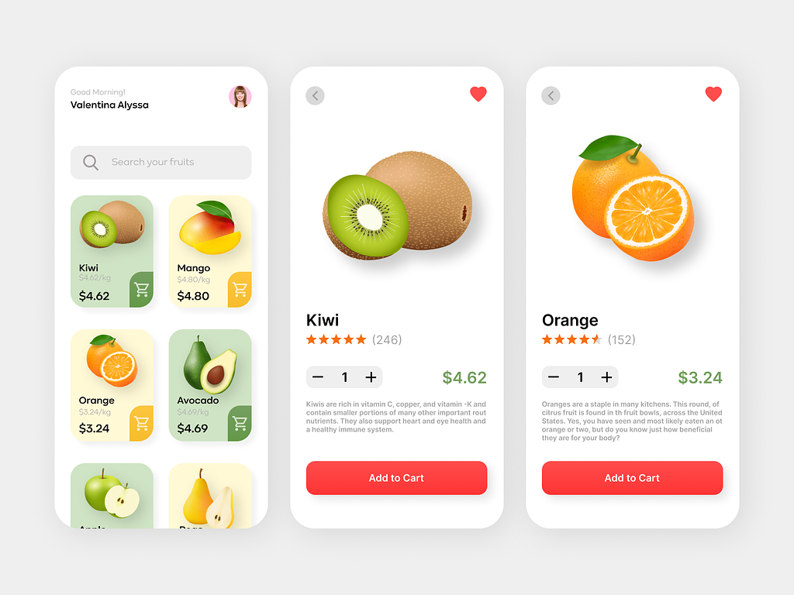
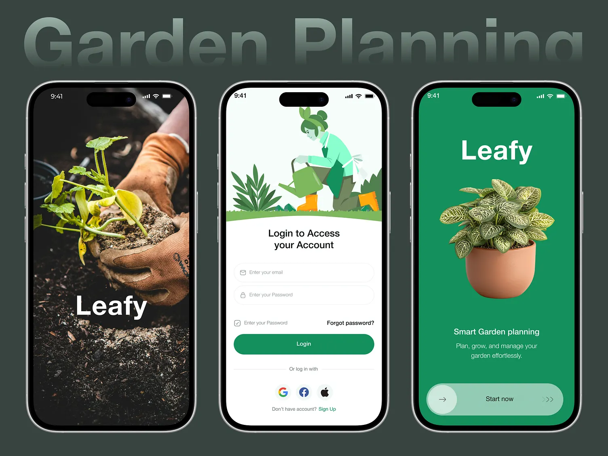

# ui_challenges_app

This project showcases a collection of UI challenges implemented using Flutter. Each challenge focuses on a specific design or interaction pattern, providing a practical way to learn and improve Flutter UI development skills.

## UI Challenges Completed

Here's a list of the UI challenges completed so far, along with screenshots:

### Challenge 1: Fruitsveg

**Description:** This challenge showcases a UI design related to fruits and vegetables. It might involve displaying a list of produce, a detailed view of a specific item, or a shopping cart interface.

**Screenshot:**

### Challenge 2: Gardenplanning

**Description:** This challenge presents a UI design related to garden planning. It could involve features like layout design, plant selection, or a calendar for gardening tasks.

**Screenshot:**

## Getting Started

This project is a starting point for a Flutter application.

A few resources to get you started if this is your first Flutter project:

- [Lab: Write your first Flutter app](https://docs.flutter.dev/get-started/codelab)
- [Cookbook: Useful Flutter samples](https://docs.flutter.dev/cookbook)

For help getting started with Flutter development, view the [online documentation](https://docs.flutter.dev/), which offers tutorials, samples, guidance on mobile development, and a full API reference.

## Contributing

Contributions are welcome! If you have a UI challenge you'd like to add, feel free to open a pull request.

## Note

- Make sure you have the images in the `assets/images/ui` folder.
- The image names are just examples, change them to the actual names of your images.
- Add more challenges as you complete them, following the same format.
- If you don't have the images yet, you can add them later, just keep the `![...]` part.
- If you don't have the assets folder, create it and add the images.
